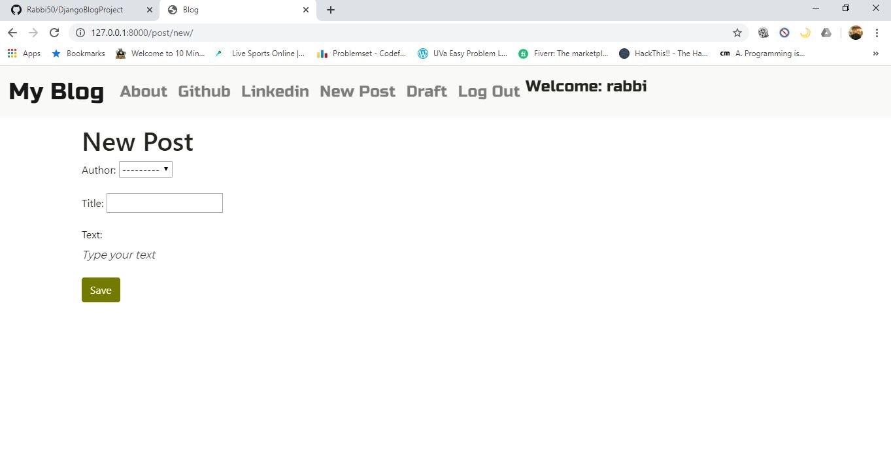

# Features
* Creat Blog Post
* Comment in blog post
* Remove blog post
* Edit blog post
* Login
* Display all blog post
* Draft
* Publish blog post

# Usage

* Sqlite Database
* Django 
* Class based views

## Getting started

Steps:

1. Clone/pull/download this repository
2. Create a virtualenv with `virtualenv env` and install dependencies with `pip install -r requirements.txt`
3. Configure your .env variables
4. Rename your project with `python manage.py rename <yourprojectname> <newprojectname>`
6. Create superuser with `python manage.py create superuser`
5. Run project on local server with `python manage.py runserver`

# Project Image

## blog porject home view.

## blog project create blog view.

